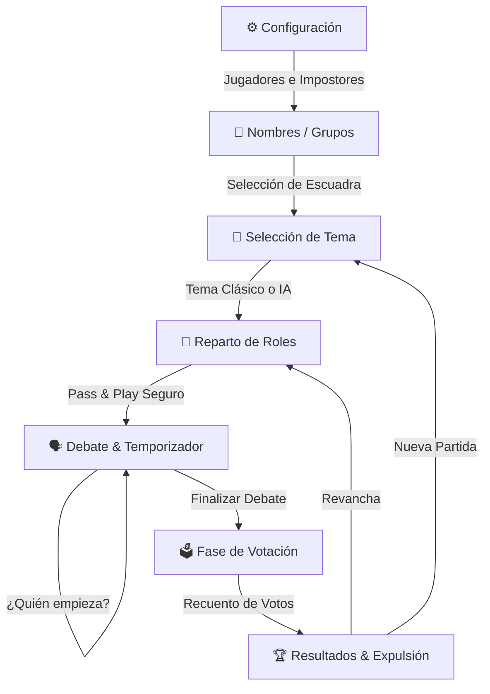

# 🕵️‍♂️ Impostor - Juego de Deducción Social & Fiesta

<p align="center">
  
</p>

<p align="center">
  <b>Un juego de fiesta estilo Pass & Play rápido, moderno y lleno de intriga, faroles y risas.</b><br>
  <i>Inspirado en clásicos de deducción social como Spyfall, Undercover y Among Us, potenciado con IA.</i>
</p>

<p align="center">
  
  
  
  
  
</p>

---

## 📖 Índice

- [✨ Características Principales](#-características-principales)
- [🎮 Modos de Juego](#-modos-de-juego)
- [🤖 Generación de Temas con IA](#-generación-de-temas-con-ia)
- [📦 Temáticas Integradas](#-temáticas-integradas)
- [🔄 Flujo del Juego](#-flujo-del-juego)
- [🛠️ Stack Tecnológico](#️-stack-tecnológico)
- [📁 Estructura del Proyecto](#-estructura-del-proyecto)
- [🚀 Instalación y Configuración](#-instalación-y-configuración)
- [📱 Compilación y Despliegue (EAS)](#-compilación-y-despliegue-eas)
- [🛡️ Manejo de Errores y Actualizaciones OTA](#️-manejo-de-errores-y-actualizaciones-ota)

---

## ✨ Características Principales

- 📱 **Modo "Pasa y Juega" (Pass & Play):** Solo se necesita un único teléfono para jugar en grupo de **3 a 16 jugadores**.
- 🎭 **Distribución de Roles Segura:** Tarjetas interactivas con gestos de pulsar para revelar que evitan que otros jugadores espíen la palabra.
- 👥 **Gestión de Grupos y Nombres:**
  - Guarda y carga escuadras frecuentes (ej. *Amigos*, *Familia*, *Oficina*).
  - Autocompletado de nombres recientes y opción de orden aleatorio.
- ⏱️ **Temporizador de Debate Dinámico:** Configurable a *Sin límite*, 1 min, 2 min, 3 min o 5 min, con barra de progreso visual.
- 🎲 **Ruleta "¿Quién Empieza?":** Seleccionador aleatorio animado para decidir quién abre la ronda de preguntas.
- 🗳️ **Sistema de Votación y Escrutinio:** Votación secreta o abierta por turnos, recuento automático y desempates.
- 💥 **Revelación Dramática de Resultados:** Animaciones de expulsión, estadísticas de la partida e historial completo de quién votó a quién.
- 🎨 **Diseño Cyberpunk / Dark OLED:** Estética visual con gradientes de neón, microinteracciones hápticas y soporte multidispositivo.

---

## 🎮 Modos de Juego

| Modo | Descripción |
| :--- | :--- |
| **🕵️ Modo Clásico** | Los **Tripulantes** reciben la palabra secreta. Los **Impostores** no conocen la palabra y deben disimular escuchando a los demás o apoyándose en una pista sutil (opcional). |
| **🎭 Modo Undercover** | Los **Tripulantes** reciben una palabra (ej. *Messi*) y los **Impostores** reciben una palabra similar o relacionada (ej. *Cristiano Ronaldo*). ¡Ninguno sabe con certeza al inicio si tiene la palabra mayoritaria o la infiltrada! |

---

## 🤖 Generación de Temas con IA

La aplicación cuenta con un creador de categorías impulsado por **Groq Cloud API** (modelos LLaMA / GPT-OSS de baja latencia):

- **Vibras / Tonos Personalizados:**
  - 🎈 **Casual:** Vocabulario cotidiano y accesible.
  - 🧠 **Experto:** Conceptos desafiantes para conocedores.
  - 🔥 **Picante:** Tono atrevido para reuniones de adultos.
  - 👨‍👩‍👧‍👦 **Familiar:** 100% apto para todas las edades.
- **Contexto Cultural Local:** Adaptado con lenguaje natural para Colombia y Latinoamérica.
- **Persistencia y Respaldo Offline:** Los temas creados se guardan en el almacenamiento local del dispositivo (`AsyncStorage`) y cuenta con plantillas de respaldo si no hay conexión a internet.

---

## 📦 Temáticas Integradas

El juego incluye más de **15 temáticas listas para jugar**, con cientos de palabras y parejas para Undercover:

- 🦁 **Animales**
- 🍕 **Comidas** *(con clásicos como Arepa, Salchipapa, Bandeja Paisa)*
- ⚽ **Deportes**
- 🎬 **Películas**
- 🌎 **Países**
- 💼 **Profesiones**
- 📍 **Lugares**
- 🎮 **Videojuegos**
- 🎵 **Música**
- 📦 **Objetos**
- 🦸‍♂️ **Superhéroes**
- 👕 **Ropa**
- 📖 **Biblia**
- 🌴 **Costeño** *(cultura y expresiones del caribe colombiano)*
- 🕊️ **Shalom**

---

## 🔄 Flujo del Juego



---

## 🛠️ Stack Tecnológico

- **Framework:** [React Native](https://reactnative.dev/) `0.81.5` con [Expo](https://expo.dev/) `~54.0.37`
- **Lenguaje:** [TypeScript](https://www.typescriptlang.org/) `~5.9.2`
- **Componentes UI & Animaciones:** `Animated` API de React Native, `expo-linear-gradient`, `@expo/vector-icons`
- **Almacenamiento Local:** `@react-native-async-storage/async-storage`
- **Inteligencia Artificial:** [Groq API](https://groq.com/) para generación instantánea de palabras y temáticas en formato JSON estructurado
- **Actualizaciones en Caliente:** `expo-updates` (OTA Updates)
- **Construcción y Distribución:** [EAS (Expo Application Services)](https://expo.dev/eas)

---

## 📁 Estructura del Proyecto

```text
impostor-game/
├── assets/                    # Iconos, splash screen y recursos visuales
├── src/
│   ├── components/            # Modales y componentes reutilizables
│   │   ├── AIThemeModal.tsx       # Creador de temáticas con IA
│   │   ├── SavedGroupsModal.tsx   # Gestor de grupos de jugadores
│   │   └── WhoStartsModal.tsx     # Ruleta para seleccionar quién inicia
│   ├── context/
│   │   └── GameContext.tsx    # Estado global del juego y lógica de partida
│   ├── data/
│   │   └── themes.ts          # Banco de temáticas y palabras predeterminadas
│   ├── screens/               # Pantallas principales del flujo
│   │   ├── SetupScreen.tsx            # Ajustes iniciales y modo de juego
│   │   ├── PlayerNamesScreen.tsx      # Edición de nombres de jugadores
│   │   ├── ThemeSelectionScreen.tsx   # Explorador y buscador de temas
│   │   ├── RoleDistributionScreen.tsx # Entrega de palabras Pass & Play
│   │   ├── PlayingScreen.tsx          # Pantalla de debate y cronómetro
│   │   ├── VotingScreen.tsx           # Votaciones de los jugadores
│   │   └── ResultsScreen.tsx          # Expulsión, victorias y recuento
│   ├── services/              # Capa de servicios externos y persistencia
│   │   ├── aiThemeService.ts          # Cliente API de Groq
│   │   └── storageService.ts          # Abstracción de AsyncStorage
│   ├── styles/
│   │   └── colors.ts          # Paleta de colores Dark / Neon y gradientes
│   └── types/
│       └── game.ts            # Interfaces TypeScript del modelo de juego
├── App.tsx                    # Punto de entrada, ErrorBoundary y navegación
├── app.json                   # Configuración del proyecto Expo y EAS
├── eas.json                   # Perfiles de compilación EAS
└── package.json               # Dependencias y scripts del proyecto
```

---

## 🚀 Instalación y Configuración

### 1. Requisitos Previos

- [Node.js](https://nodejs.org/) (versión 18 o superior)
- [npm](https://www.npmjs.com/) o [yarn](https://yarnpkg.com/)
- [Expo Go](https://expo.dev/go) instalado en tu dispositivo móvil (Android / iOS) o un emulador configurado.

### 2. Clonar el Repositorio

```bash
git clone https://github.com/tu-usuario/impostor-game.git
cd impostor-game
```

### 3. Instalar Dependencias

```bash
npm install
```

### 4. Variables de Entorno

Copia el archivo de ejemplo `.env.example` a `.env` y añade tu clave de API de Groq (necesaria para la generación de temas con IA):

```bash
cp .env.example .env
```

Edita `.env`:
```env
EXPO_PUBLIC_GROQ_API_KEY=tu_api_key_de_groq_aqui
```

> 💡 *Nota:* Puedes obtener una API Key gratuita de alta velocidad registrándote en [Groq Console](https://console.groq.com/).

### 5. Iniciar el Servidor de Desarrollo

```bash
# Iniciar con Expo CLI
npm start

# O iniciar directamente para una plataforma específica
npm run android   # Para Android
npm run ios       # Para iOS (requiere macOS)
npm run web       # Para navegador web
```

Escanea el código QR con la aplicación **Expo Go** en Android o la app de **Cámara** en iOS.

---

## 📱 Compilación y Despliegue (EAS)

El proyecto está configurado para compilarse mediante **EAS Build**.

### Generar APK de Previsualización (Android)

```bash
# Instalar EAS CLI de forma global (si no lo tienes)
npm install -g eas-cli

# Iniciar sesión en tu cuenta de Expo
eas login

# Compilar APK instalable directamente
eas build -p android --profile preview
```

### Compilar para Producción

```bash
eas build -p android --profile production
```

---

## 🛡️ Manejo de Errores y Actualizaciones OTA

- **ErrorBoundary Global:** `App.tsx` implementa un capturador de errores a nivel raíz que evita cierres inesperados de la app ante fallos en renderizado, permitiendo reiniciar el estado de forma segura.
- **Badge de Versión y Bundle:** La pantalla de configuración muestra la versión y el identificador corto del bundle en tiempo real para verificar al instante la recepción de actualizaciones en vivo (*Over The Air*).
- **Límite de Impostores Seguro:** El sistema calcula matemáticamente que los impostores nunca superen el 50% de la sala, garantizando partidas equilibradas en todo momento.

---

## 🤝 Contribuciones

¡Las contribuciones, sugerencias de nuevas palabras o temáticas son bienvenidas!

1. Haz un **Fork** del proyecto.
2. Crea una rama para tu feature (`git checkout -b feature/NuevaTematica`).
3. Realiza tus cambios y haz commit (`git commit -m 'feat: añadir temática de mitología'`).
4. Haz push a tu rama (`git push origin feature/NuevaTematica`).
5. Abre un **Pull Request**.

---

## 📄 Licencia

Distribuido bajo la Licencia **MIT**. Consulta `LICENSE` para más información.

<p align="center">
  Hecho con ❤️ para noches de juego inolvidables entre amigos y familia.
</p>
